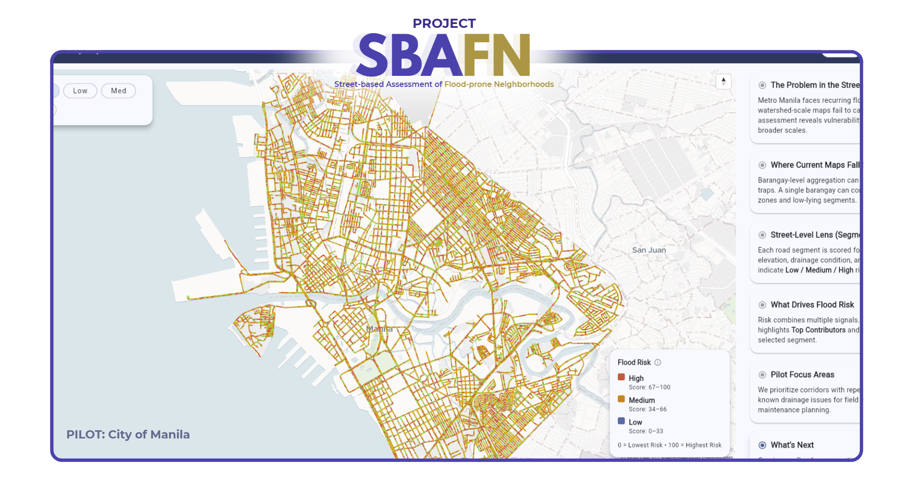
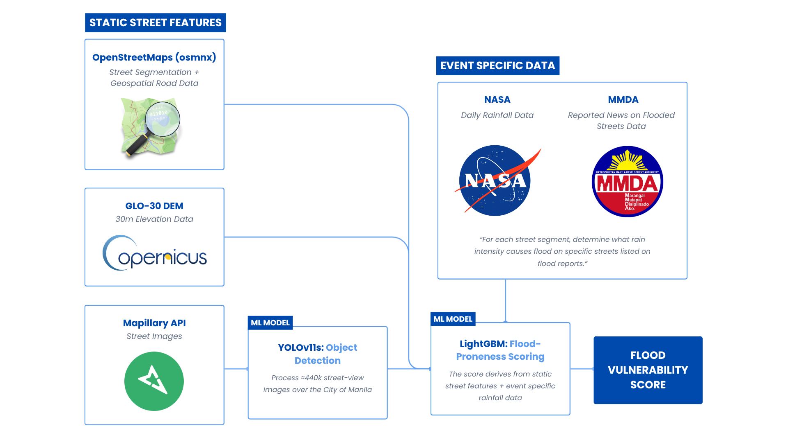

# Project SBAFN (Street-based Assessment for Flood-prone Neighborhoods)

## 📖 Overview

Project SBAFN is an explainable, **street-level flood-proneness** visualization and decision-support app for Philippine cities. It visually communicates per-street, evidence-backed flood insights that planners can act on.

> This project aims to supersede **Project NOAH**, the Philippines' state-of-the-art initiative that provides area-based hazard overview, highlighting flood hazard zones at the national level. SBAFN offers the next step by covering the existing gaps of NOAH, by showing the street-level specifics of why floods happen, and give the explainability that was long needed for actual, effective decision making.

## 🔎 What SBAFN Adds

- **Street-segment granularity:** scores every road segment (green/yellow/red) instead of broad barangay/city polygons.
- **Explainability panel:** shows *why* a specific street scores that way. It includes insights about:
  - Physical indicators (e.g., drainage grates, curb inlets, proximity to canals)
  - Topography (e.g., elevation, relative elevation, slope)
  - Road Data (e.g., width/class/intersections)
- **Scenario + Prioritization:** stress-test each street segment based on previous reported rainfall events (25/50/100 mm/hr rain).
- **Actionable outputs:** export GeoJSON/CSV for LGU planning, work orders, and DRRM briefings.

> For the specifics, refer to the overview in the Methodology section below or `docs/METHODOLOGY.md`.
_____________

## 🎯 Methodology

### A. 🌊 Flood-Proneness Indicators

Project SBAFN employs a hybrid geo implementation, employing both raster and vector geodata. Specifically through the following metrics:

<table>
    <thead>
        <tr>
            <th>Feature Type</th>
            <th>Indicator Name</th>
        </tr>
    </thead>
    <body>
        <tr>
            <td rowspan="6">Physical Indicators</td>
            <td>Curb Inlets</td>
        </tr>
        <tr>
            <td>Drainage Grates</td>
        </tr>
        <tr>
            <td>Vegetation Strips</td>
        </tr>
        <tr>
            <td>Open Canals</td>
        </tr>
        <tr>
            <td>Curb Height (to add)</td>
        </tr>
        <tr>
            <td>Driveway Gaps (to add)</td>
        </tr>
        <tr>
            <td rowspan="3">Topographic Data</td>
            <td>Absolute Elevation</td>
        </tr>
        <tr>
            <td>Relative Elevation</td>
        </tr>
        <tr>
            <td>Road Slope</td>
        </tr>
        <tr>
            <td rowspan="2">Geospatial Data</td>
            <td>Road Classification</td>
        </tr>
        <tr>
            <td>Road Width (to add)</td>
        </tr>
    </body>
</table>

➡️ Full definitions, examples, and edge cases: see [`docs/INDICATORS.md`](docs/INDICATORS.md)

## 🤖 Models

### Physical Flood-Vulnerability Indicators: Object Detection Model

* Architecture: YOLOv11
* To be trained over ≈440k street-view images over the City of Manila
  * Currently trained over a subset 1600 images for version 1.0

### Flood-Proneness Scoring: Positive-Unlabeled (PU) Model

* Architecture: LightGBM
* Trained over the static per-street features mapped to each reported rainfall event to train on scenario-based intuition
* Outputs a flood-proneness probability score [0, 1]

➡️ Full model detailings: see [`docs/MODELS.md`](docs/MODELS.md)

## 🛣️ Roadmap

Project SBAFN envisions to expand its feature to the following in future versions:

* Expand to other Philippine cities
* Context-based Story Map Generation
* AI Assistant
* Flood-aware Routing (for citizens)

## 🪪 License

* **Code**: Apache-2.0 (see `LICENSE`).
* **Content/Imagery**: Mapillary imagery is not included in this repo and is governed by Mapillary’s Terms of Use and attribution rules. We only store metadata and our own annotations.

## Team

### Lance Alexander P. Ventura

* School: Manuel S. Enverga University Foundation Lucena
* Program: BS Computer Science
* Specialization: Data Science
* Email: vlancealexander@gmail.com

### Peter Angelo C. Dantes

* School: Manuel S. Enverga University Foundation Lucena
* Program: BS Computer Science
* Specialization: Data Science
* Email: petergelodantes@gmail.com

### Rainzle John M. Estuesta

* School: Manuel S. Enverga University Foundation Lucena
* Program: BS Computer Science
* Specialization: Data Science
* Email: rjestuesta@gmail.com

### Juan Carlos R. Macatangga

* School: Manuel S. Enverga University Foundation Lucena
* Program: BS Computer Science
* Specialization: Data Science
* Email: juanmacatangga1@gmail.com