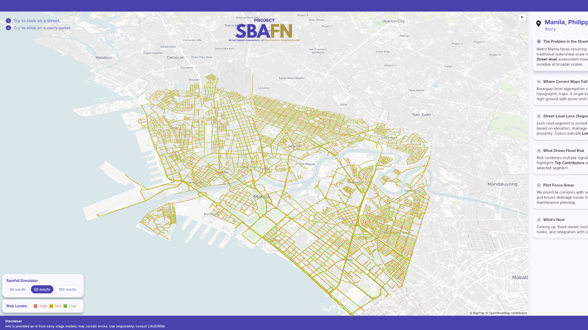

# Project SBAFN (Street-based Assessment for Flood-prone Neighborhoods)

## 📖 Overview

Project SBAFN is an explainable, **street-level flood-proneness** visualization and decision-support app for Philippine cities. It visually communicates per-street, evidence-backed flood insights that planners can act on.

> This project aims to supersede **Project NOAH**, the Philippines' state-of-the-art initiative that provides area-based hazard overview, highlighting flood hazard zones at the national level. SBAFN offers the next step by covering the existing gaps of NOAH, by showing the street-level specifics of why floods happen, and give the explainability that was long needed for actual, effective decision making.



## 🔎 What SBAFN Adds

- **Street-segment granularity:** scores every road segment (green/yellow/red) instead of broad barangay/city polygons.
- **Explainability panel:** shows *why* a specific street scores that way. It includes insights about:
  - Physical indicators (e.g., drainage grates, curb inlets, proximity to canals)
  - Topography (e.g., elevation, relative elevation, slope)
  - Road Data (e.g., width/class/intersections)
- **Scenario + Prioritization:** stress-test each street segment based on previous reported rainfall events (25/50/100 mm/hr rain).
- **Actionable outputs:** export GeoJSON/CSV for LGU planning, work orders, and DRRM briefings.

➡️ For the specifics, refer to the overview in the Methodology section below or `docs/METHODOLOGY.md`.
_____________

## 🚩 Get Started

### View Deployment

The latest version of Project SBAFN can be accessed through the following link:

`https://project-sbafn.vercel.app`

### Install Locally

#### A. Prerequisites

To setup this project locally, ensure you have:

| Requirement   | Version                                               |
| ------------- | ----------------------------------------------------- |
| Python        | 3.11+                                                 |
| Git           | 2.30+                                                 |
| Flutter       | 3.35+                                                 |

#### B. Setup

The following indicates a quick step-by-step to run the project using **Windows PowerShell**.

```bat
REM 1) Clone the repo (pick one)
git clone git@github.com:KubangPawis/project-sbafn.git
git clone https://github.com/KubangPawis/project-sbafn.git

REM 2) Go into the project folder
cd /d C:\path\to\project-sbafn
```

**Run the app (Flutter web):**

``` bat
REM 1.) Navigate to the Flutter app directory
cd sbafn_app

REM 2.) Run the app
flutter run -d chrome --dart-define=MAPTILER_KEY=<INSERT_API_KEY>
```

**(Optional) Rebuild data pipeline**
Warning: large downloads; can take 24h+ on first run.

``` bat
REM 1) Create and activate a venv
py -3.11 -m venv .venv
.venv/Scripts/Activate.ps1

REM 2) Install Python dependencies
python -m pip install -U pip
python -m pip install -r requirements.txt

REM 3) Run pipeline
python -m pipeline.core
```

> Note: Large third-party data (e.g., Mapillary imagery) is not stored in this repo due to licensing and size. Use the provided scripts to fetch and prepare data, or download precomputed artifacts from the Releases page.

## 🎯 Methodology


### A. 🌊 Flood-Proneness Indicators

Project SBAFN employs a hybrid geo implementation, employing both raster and vector geodata. Specifically through the following metrics:

<table>
    <thead>
        <tr>
            <th>Feature Type</th>
            <th>Indicator Name</th>
        </tr>
    </thead>
    <body>
        <tr>
            <td rowspan="6">Physical Indicators</td>
            <td>Curb Inlets</td>
        </tr>
        <tr>
            <td>Drainage Grates</td>
        </tr>
        <tr>
            <td>Vegetation Strips</td>
        </tr>
        <tr>
            <td>Open Canals</td>
        </tr>
        <tr>
            <td>Curb Height (to add)</td>
        </tr>
        <tr>
            <td>Driveway Gaps (to add)</td>
        </tr>
        <tr>
            <td rowspan="3">Topographic Data</td>
            <td>Absolute Elevation</td>
        </tr>
        <tr>
            <td>Relative Elevation</td>
        </tr>
        <tr>
            <td>Road Slope</td>
        </tr>
        <tr>
            <td rowspan="2">Geospatial Data</td>
            <td>Road Classification</td>
        </tr>
        <tr>
            <td>Road Width</td>
        </tr>
    </body>
</table>

➡️ Full definitions, examples, and edge cases: see [`docs/INDICATORS.md`](docs/INDICATORS.md)

## 🤖 Models

### Street-View Indicators: Object Detection

* **Model**: YOLOv11
* **Data:** Manila street-view corpus (**330k+** images); trained on a labeled subset for v1.0
* **Output:** Physical indicator count per street segment

### Flood-Proneness Scoring: Positive-Unlabeled (PU) Model

* **Model**: LightGBM
* **Inputs:** Physical indicators, topography, road network, rainfall/reports
* **Output:** calibrated flood-proneness probability score [0, 1]

➡️ Full model detailings: see [`docs/MODELS.md`](docs/MODELS.md)

> **Disclaimer (Pilot):** Scores are model-derived estimates and may be inaccurate. **Not for emergency use**—verify with LGU/DRRM advisories.

## 🛣️ Roadmap

Project SBAFN envisions to expand its feature to the following in future versions:

- Scale beyond Manila → Metro Manila → nationwide
- Context-based Story Map generation
- AI Assistant for natural-language queries
- Flood-aware routing (citizen view)

## 🪪 License

* **Code**: Apache-2.0 (see `LICENSE`).
* **Street View Imagery**: Mapillary imagery is not included in this repo and is governed by Mapillary’s Terms of Use and attribution rules. We only store metadata and our own annotations.
- **Elevation data (DEM):** Contains modified Copernicus DEM (GLO-30). © European Union, 1995–2025, produced using Copernicus data and information funded by the European Union — accessed via the AWS Open Data Registry. See Copernicus terms of use and license.

> This repository does **not** grant rights to any third-party datasets. Use of Mapillary/Copernicus materials must follow their respective licenses and terms.

## Team

### Lance Alexander P. Ventura

* School: Manuel S. Enverga University Foundation Lucena
* Program: BS Computer Science
* Specialization: Data Science
* Email: vlancealexander@gmail.com

### Peter Angelo C. Dantes

* School: Manuel S. Enverga University Foundation Lucena
* Program: BS Computer Science
* Specialization: Data Science
* Email: petergelodantes@gmail.com

### Rainzle John M. Estuesta

* School: Manuel S. Enverga University Foundation Lucena
* Program: BS Computer Science
* Specialization: Data Science
* Email: rjestuesta@gmail.com


### Juan Carlos R. Macatangga

* School: Manuel S. Enverga University Foundation Lucena
* Program: BS Computer Science
* Specialization: Data Science
* Email: juanmacatangga1@gmail.com